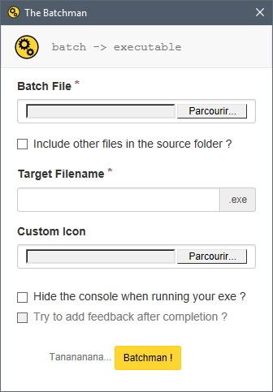

# The Batchman 

> Slapping those *quick and dirty* **batch** scripts into **executable** programs, one at a time...

The Batchman converts Windows batch or HTA files into compressed executable files, with the following options :

+ Include files located in the folder of your file.
+ Customize the icon.
+ Run your executable without showing the console. (for batch files)
+ If the console is hidden, add a completion feedback in the form of a dialog box. (for batch files)

#### Screenshot

#### Holy contortion, batchman !
The Batchman distribution is itself a batch/HTA/JS application packaged into a nice executable file right here :
**[Download](https://github.com/jeremyben/thebatchman/releases/download/v1.0/TheBatchman.x86.zip)**

## Usage
Simply run thebatchman.exe and fill in the form.
The application will **output the executable file to the same folder** where your batch/HTA file resides.

### Options
+ **Include all the other files located in the same folder of your batch/HTA script :**
You can package and use any binary or other dependency in a portable way.
+ **Hide the console when running your executable program (Batch) :**
By default, running Batch scripts on Windows launches the console. Executables made with The Batchman actually run the batch script packaged inside. You have the possibility to hide the console while the executable is running.
+ **Add a completion feedback (Batch) :**
If you choose to hide the console during the execution of your program, you might want to have a feedback to know when the script has ended.
To achieve that, The Batchman adds a label named `completion` and a few lines at the end of your batch script starting a small HTA alert box when it reaches it.
So think of adding `goto completion` in your script instead of `goto:eof` if you want this feature to work correctly.
*The Batchman used to parse the script and rewrite `goto:eof` into `goto completion`, but it had obvious side effects with some subroutines, so it's better you do that manually.*

## Compatibility
Tested on Windows 10 x64, but should work on every Windows up to XP SP2 (x86 or x64), as long as you have Internet Explorer 8 or more recent.

## Included dependencies and licensing
+ [7-zip command-line](http://www.7-zip.org/) 15.12 (under GNU LGPL)
+ [7-zip modified SFX modules](http://7zsfx.info/en/) 1.6 (under GNU LGPL)
+ [Anolis Resourcer](http://anolis.codeplex.com/) 0.9 (under GNU GPLv2)
+ [UPX](http://upx.sourceforge.net/) 3.91 (under GNU GPL)
+ [sed for Windows](http://gnuwin32.sourceforge.net/packages/sed.htm) 4.2.1 (under GNU GPL)
+ [Bootstrap](http://getbootstrap.com/) 3.3.5 (under MIT)

This project is itself licensed under the terms of the GNU GPLv2 license.

## Notes
This application is for "quick and dirty" purposes. Both HTA and Batch are legacy technologies, even if they're still supported on modern Windows platforms.
